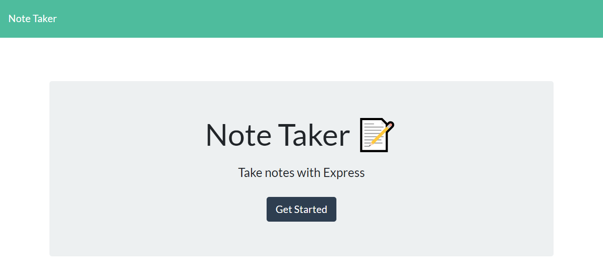
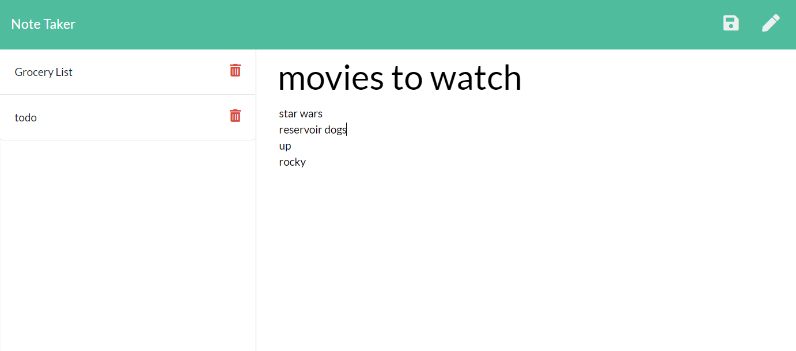

# Note Taker

## Description

Note Taker is a web application that can be used to write, save, and delete notes.

## Table of Contents

- [Installation](#installation)
- [Usage](#usage)
- [Screenshots](#screenshots)
- [License](#license)
- [Contributing](#contributing)
- [Questions](#questions)

## Installation

To install the required dependencies, run the following command:

```
npm install
```

## Usage

To start the server, run the following command:

```
npm start
```

Then you can access the application in your browser at http://localhost:3000

## Screenshots




## License

This project is licensed under the MIT License - see the [LICENSE](LICENSE.md) file for details.

## Contributing

If you want to contribute, open a Pull Request and include a detailed description and screenshots of the changes.

## Questions

If you have any questions about the repo, open an issue or contact [ryan-harris](https://github.com/ryan-harris) directly at harris.ucla@gmail.com.
